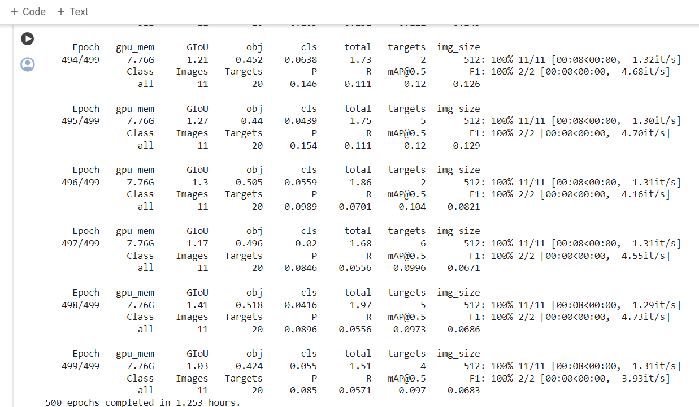
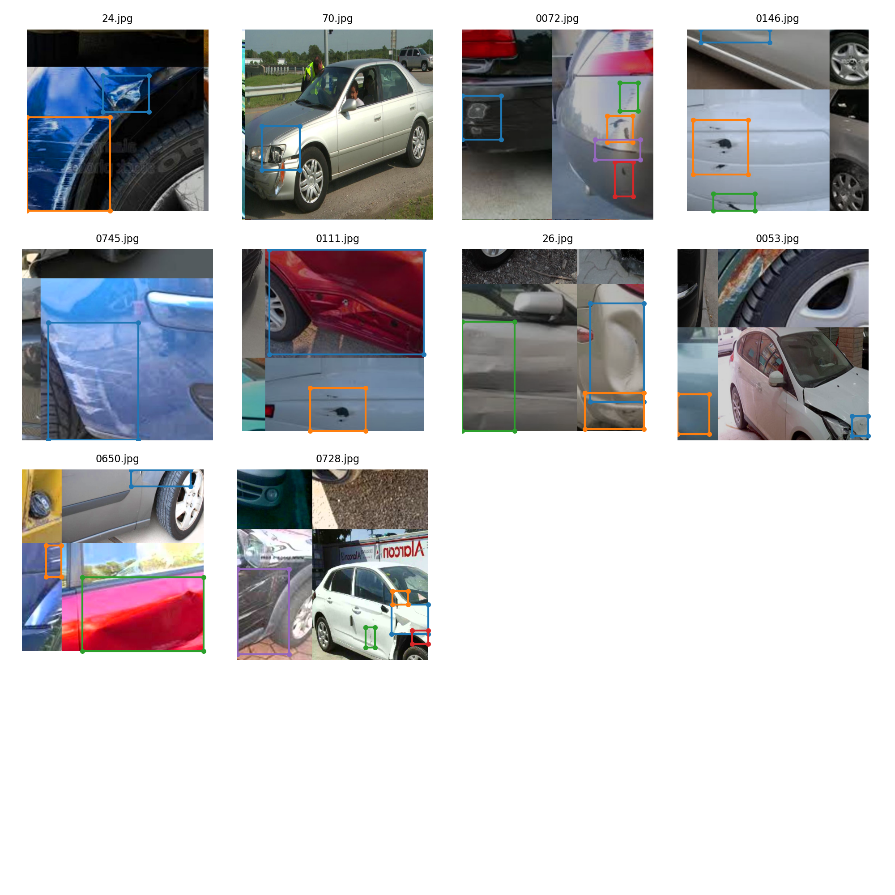
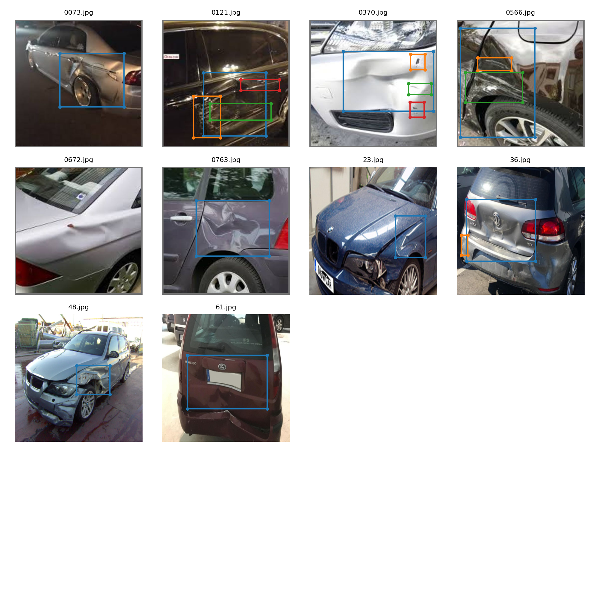
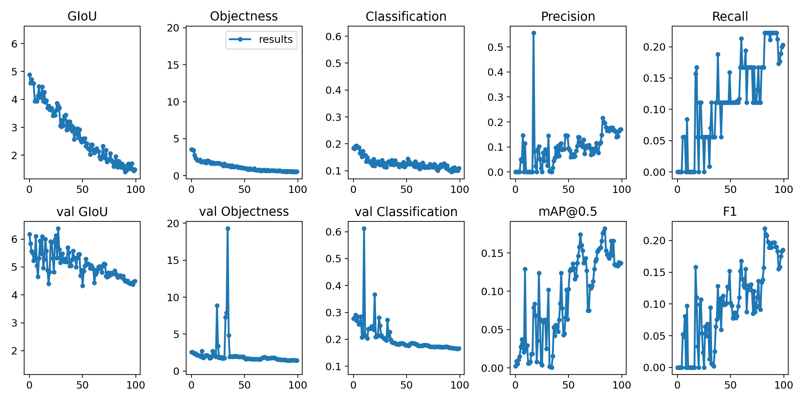

# Assignment 12

# Problem Statement
To train a custom YOLOV3 model. Here, I have chosen to detect dent and scratches in a car. So the annotations have been done using the given tool and created in yolov3 format.
the total number of classes are 2.

# File Structure

repo contains all the code required during training in different modules
   - S12.ipynb -> contains the execution of code 

# Model observations
 
# Training Logs

    

train batch image

    

test batch image

    

       

# Results
Output graphs

    

